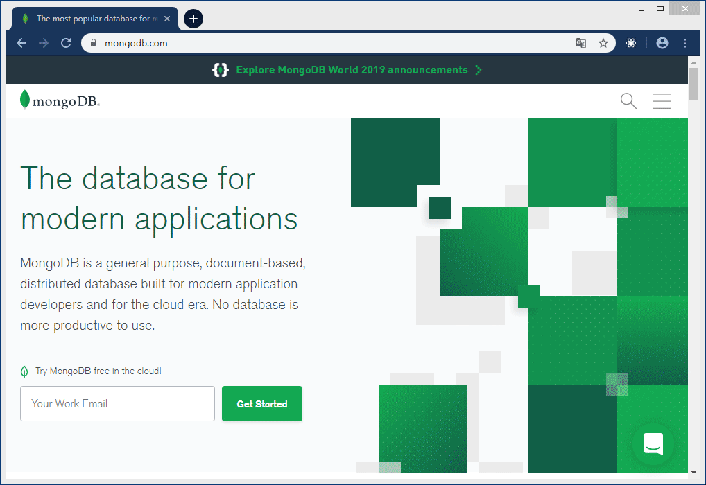
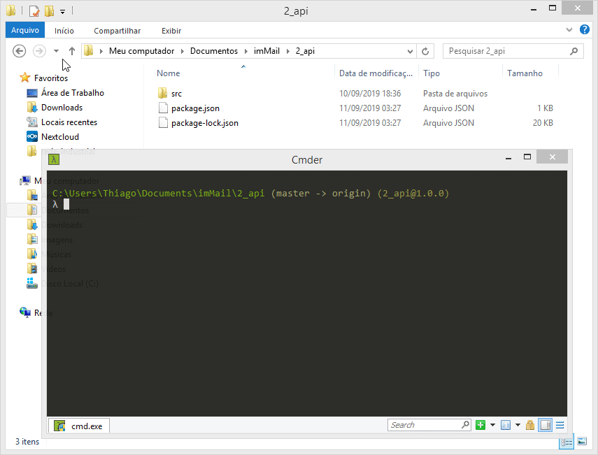

# Teste ImMail - Vaga Desenvolvedor Web

A descrição das tarefas a serem realizadas estão no endereço https://gist.github.com/rmsouza/2efecb67b803da5e9fa67de2cc1602e9 e também no arquivo ***task.md*** localizado nesse projeto.

# Estrutura do projeto

| Pasta      | Descrição                                                    |
| ---------- | ------------------------------------------------------------ |
| 1_parse    | Realiza a leitura do arquivo ***game.log*** e salva no MongoDB em Cloud. |
| 2_api      | API Restfull rodando na porta 2000 para servir os dados do MongoDB para o Frontend. |
| 3_frontend | Frontend em ReactJS, consumindo API (*2_api*).               |

# Banco de dados

Foi utilizado o serviço de Cloud do site https://www.mongodb.com.

# Executando o projeto

### Preparação do ambiente

É necessário instalar ***NodeJS*** e o gerenciador de pacotes Javascript ***Yarn***.

Link de instalação do NodeJS https://nodejs.org/en/download/package-manager/

Link de instalação do Yarn https://yarnpkg.com/lang/pt-br/docs/install

### Execução

##### 1_parse:

Na raiz da pasta *1_parse* executar:

1. `yarn install` para baixar as dependências do projeto;
2. `yarn start` para executar o script;

##### 2_api:

Na raiz da pasta *2_api* executar:

1. `yarn install` para baixar as dependências do projeto;
2. `yarn start` para executar o script;

##### 3_frontend:

Na raiz da pasta *3_frontend* executar:

1. `yarn install` para baixar as dependências do projeto;
2. `yarn start` para executar o script;

Vídeo do APP em funcionamento https://youtu.be/xMbUgCTIb3c

# Quesitos não cumpridos

Não foram realizados suíte de testes como solicitado no *Quesito 2* devido minha ignorância no assunto, entretanto, foram realizados testes "metodologia própria" em cada etapa do desenvolvimento.

Obrigado.

Att, Thiago Cabral